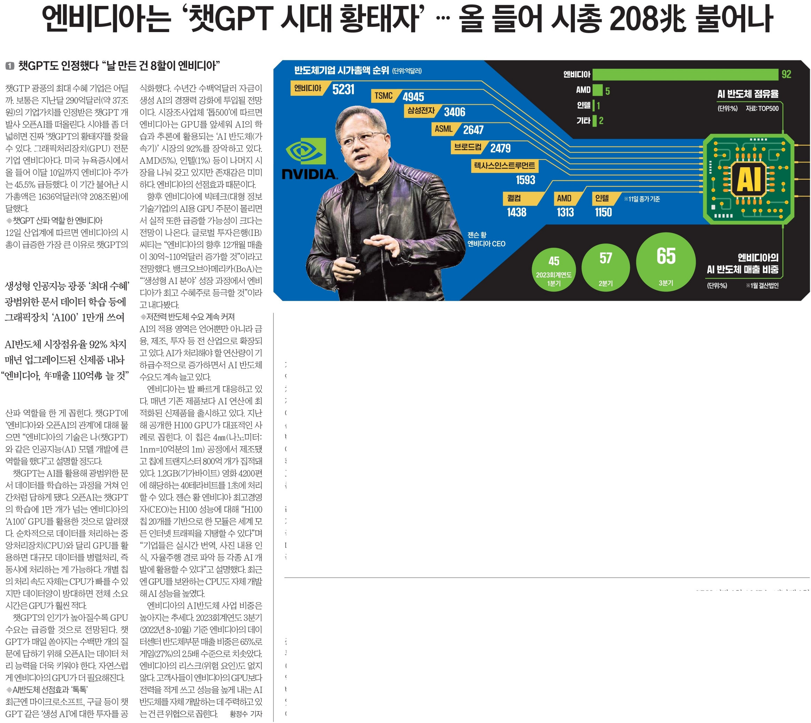

# Let's learn about ChatGPT

2023년 2월 13일 월요일 한국경제 신문 1면에 ChatGPT가 등장한 것을 보고, ChatGPT에 대한 내용을 정리할 필요성을 느꼈다.

## 1. What is ChatGPT?

전공자, 비전공자 할 것 없이 한 번쯤은 들어봤을 법한 챗GPT(ChatGPT). 한 마디로 정리하자면 'AI 채팅'입니다.

'그냥 심심이 아니야?'

라는 생각을 하실수도 있겠죠? (너무 old한 예시였나요,,^^)

근데 이 챗GPT는 우리가 입력한 내용에 대해서 순식간에 엄청난 작업을 처리합니다. 대표적인 예로는 입력된 텍스트를 요약해준다거나, 어떤 현상에 대한 기사를 써준다거나, 사용자가 작성한 코드에 대한 리뷰까지도 해줍니다.

